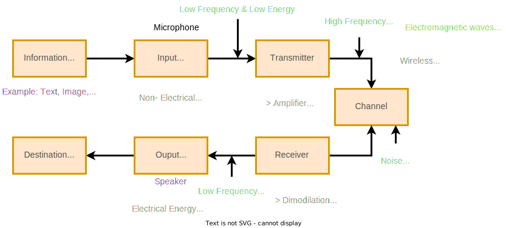

## Block Diagram



- Resources:
  [Communication System Block diagram Explain](https://youtu.be/CkanrZD-0Ew?list=PLUyMayDZBhiwAwraPQFd6CjbHQygcY0vB)

## Baseband and Passband Signal


- Resources:
  [Baseband and Passband Signal](https://youtu.be/Tp89619XK5Y?list=PLUyMayDZBhiwAwraPQFd6CjbHQygcY0vB)

### Baseband Signal

1. All sources of information generates baseband single.
   - Exp: Audio, Video, Image
2. Signals are transmitted without modulation.
   - Exp: Landline
3. (0 to 20khz) Audio S/g & (0 to 55Mhz) Video S/g
4. Frequency Domain
   ```
   ▲
   │
   │ Amplitude
   ├────┐
   │    │
   │    │
   └────┴──────► Frequency
       Fm(Frequency modulation)
   ```

### Passband Signal

1. Baseband signal transmitted at high frequancy modulation signal.
   - Exp: AM, FM, PM
2. It is high frequency Modulated carrier signal.
   - Exp: Satalite Signal
3. (550Khz to 1640kHz) for AM & (88Mhz to 108MHz) for FM
