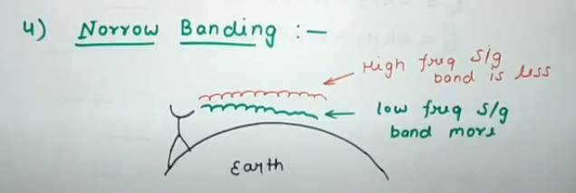

## Hight of Antinna

|     Value    | SI symbol |     Name    |
|:------------:|:---------:|:-----------:|
| $10^1$ Hz    |    daHz   |  decahertz  |
| $10^2$ Hz    |    hHz    |  hectohertz |
| $10^3$ Hz    |    kHz    |  kilohertz  |
| $10^6$ Hz    |    MHz    |  megahertz  |
| $10^9$ Hz    |    GHz    |  gigahertz  |
| $10^{12}$ Hz |    THz    |  terahertz  |
| $10^{15}$ Hz |    PHz    |  petahertz  |
| $10^{18}$ Hz |    EHz    |   exahertz  |
| $10^{21}$ Hz |    ZHz    |  zettahertz |
| $10^{24}$ Hz |    YHz    |  yottahertz |
| $10^{27}$ Hz |    RHz    |  ronnahertz |
| $10^{30}$ Hz |    QHz    | quettahertz |

$$\lambda={c \over f},\ L ={\lambda \over 4}$$

- $\lambda$ - Is wavelenght.
- $c$ - Velocity of light. - $3 \times 10^8$
- $f$ - Frequency - The Value of hertz

Exp:-
$$
fm = 3kH_z,\ 
d = {c \over f} 
= {3 \times 10^8 \over 3 \times 10^3} 
=  10^5\text{ m}
= 100\text{ km}
$$
- Because  $3\text{ khz}$ the $10^3$ the bottom answer.

If:-
$$
fc = 1Gh_z,\ 
d = {c \over f} =
{3 \times 10^8 \over 1 \times 10^9} =
0.3m
$$
$$
L
= {d \over 4}
= {0.3 \over 4}
= 0.075m
$$

The answer to the expression ${3 \times 10^8 \over 3 \times 10^3}$ is $10^5$.

To obtain this answer, we can perform the calculations as follows:

$3 \times 10^8 \div 3 \times 10^3$

Since multiplication and division have the same precedence, we can perform the calculations from left to right.

$(3 \times 10^8) \div (3 \times 10^3)$

We can simplify the expression inside the parentheses:

$(3 \times 10^8) \div (3 \times 10^3)$

$= (3 \times 10^8) \div (3 \times 10^3)$

$= 3 \times (10^8 \div 10^3)$
$= 3 \times 10^5$

## Multiplexing
$f_1 = 2\text{ kHz to }  10\text{ kHz} \to fc_1 = 10.1\text{ GHz}$

$f_2 = 2\text{ kHz to } 10\text{ kHz} \to fc_2 = 10.2\text{ GHz}$

$f_3 = 2\text{ kHz to } 10\text{ kHz} \to fc_3 = 10.3\text{ GHz}$

Types of Multiplexing:
- Frequency Division Multiplexing(FDM)
- Time Division Multiplexing (TDM)
- Cors Division Multiplexing (CDMA)

## High Bandwith
From $20\text{ Hz to }20\text{ kHz}$ is High Bandwith

## Narrow Banding

## Radiated Power by Antinna
$$ Pr \propto {1 \over \lambda^2}$$
